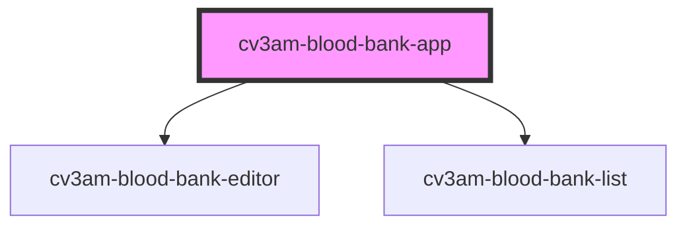

# cv3am-blood-bank-app

<!-- Auto Generated Below -->

## Properties

| Property      | Attribute       | Description | Type     | Default     |
| ------------- | --------------- | ----------- | -------- | ----------- |
| `apiBase`     | `api-base`      |             | `string` | `undefined` |
| `basePath`    | `base-path`     |             | `string` | `""`        |
| `bloodBankId` | `blood-bank-id` |             | `string` | `undefined` |

## Dependencies

### Depends on

- [cv3am-blood-bank-editor](../cv3am-blood-bank-editor)
- [cv3am-blood-bank-list](../cv3am-blood-bank-list)

### Graph

----------------------------------------------

*Built with [StencilJS](https://stenciljs.com/)*
