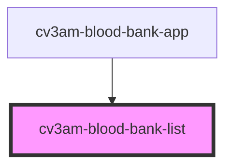

# cv3am-blood-bank-list

<!-- Auto Generated Below -->

## Properties

| Property      | Attribute       | Description | Type     | Default     |
| ------------- | --------------- | ----------- | -------- | ----------- |
| `apiBase`     | `api-base`      |             | `string` | `undefined` |
| `bloodBankId` | `blood-bank-id` |             | `string` | `undefined` |

## Events

| Event         | Description | Type                  |
| ------------- | ----------- | --------------------- |
| `bag-clicked` |             | `CustomEvent<string>` |

## Dependencies

### Used by

 - [cv3am-blood-bank-app](../cv3am-blood-bank-app)

### Graph

----------------------------------------------

*Built with [StencilJS](https://stenciljs.com/)*
